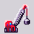

 # `Hi, I’m Petrhonez` 

> ##  About me
>
> I'm 22 and currently studying Control and Automation Engineering. 
> 
> I'm using GitHub just as an expression of my ideas and projects, for fun and experience. 
> 
> I'm focused on developing devices for human machine interaction, and Mnemonic Systems. 
>
> 
---
 
> ##  Interests

 
Aplication

 
Ubiquitous Systems 
 
Heuristic Operations 
 
Microcontrollers and embedded systems for control 
  

---

> ##  Search area

 
Knowledge to seek

 
Cognitive Assistence 

Decision Suport

---

> ##  Vision

  
 Future goals 

Apply automation and embedded tech to creative hardware products
 
Build tools and devices that expand how we memorize 
  

---

> ## All repositories
 

  
 Click to expand my projects

   
   
 

 

---

> ###  `Contact`
>
> pfcandez01@gmail.com

